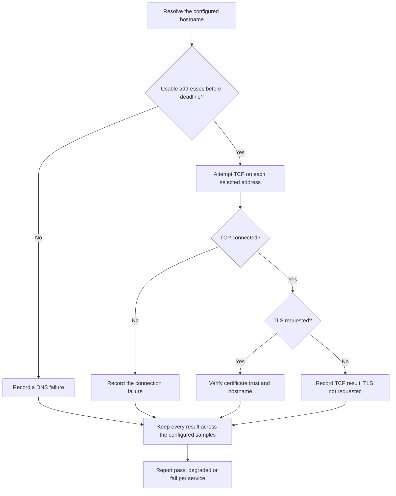

# Service Path Check

**Find which stage of a configured service connection needs attention.**

A server answers ping but the service still does not work. Check name resolution, the actual TCP port and optional verified TLS separately, then save the findings.

[Download Windows app](https://github.com/thisisraihanm/service-path-check/releases/latest) · [Start here](START-HERE.md) · [Visual guide](docs/VISUAL-GUIDE.md) · [Technical reference](docs/TECHNICAL-REFERENCE.md)


## Try it in three steps

1. **Download and open.** On the [release page](https://github.com/thisisraihanm/service-path-check/releases/latest), download **ServicePathCheck-Windows.zip** under Assets, choose **Extract All**, then open **ServicePathCheck.exe**. Python is included.
2. **Try a safe example.** Click **Try a safe example**. It uses fictional data so you can learn what the results mean first.
3. **Use your own inputs.** Enter a website address and click **Check connection**. For an office file server, choose **Windows file server** and enter the name supplied by IT.

The tool reads and reports; it does not repair settings or copy/delete your files. See the [beginner guide](START-HERE.md) for help opening the unsigned Windows app and choosing the right download.

## See the result before installing


*Rendered from the actual HTML report with fictional demo data. This is a report preview, not a production result or Windows desktop screenshot.*

| Example item | Result | What you are seeing |
|---|---|---|
| Lab portal | Fail | DNS and TCP pass, but TLS hostname verification fails. |
| Lab file service | Degraded | Two of three fictional TCP samples pass; one times out. |

[See the detailed report image and decision flowchart →](docs/VISUAL-GUIDE.md)

## What happens inside



## Run the offline demo from source

Requires **Python 3.11+**. No pip packages are needed for the application. From this repository directory:

```sh
python service_path_check.py --demo
```

Open `reports/service-path.html`. The neighboring JSON file contains the detailed evidence. Exit code **1** is expected because the fictional demo deliberately includes findings.

For the source desktop interface, install Python with Tcl/Tk and open `Start-Windows.cmd` on Windows, or run `python3 desktop.py` on Linux/macOS. Windows settings collection is available only on Windows.

## Scope and evidence

Tests only explicitly configured endpoints. A successful path does not establish login access, application functionality or uptime. A failed connection alone cannot identify the responsible device. The offline demo sends no network traffic.

- [Visual walkthrough](docs/VISUAL-GUIDE.md): architecture, decisions and report previews.
- [Lab exercise](WALKTHROUGH.md): reproduce and explain the behavior.
- [Technical reference](docs/TECHNICAL-REFERENCE.md): commands, interpretation, limitations and official references.
- [Example HTML](docs/demo-report.html) and [JSON evidence](docs/demo-report.json): fictional demonstration output. Download the HTML to view it in a browser.
- [Automated checks](https://github.com/thisisraihanm/service-path-check/actions): inspect the run and commit before drawing conclusions.

Run the existing test suite with `python -m unittest discover -s tests -v`.

## Learning focus

TCP/IP troubleshooting, DNS resolution, TCP connectivity, TLS validation and careful interpretation of network evidence.

MIT licensed. Prepared with AI assistance for Raihan Mahmud's learning portfolio. No production deployment, business impact or operational recovery success is claimed.
