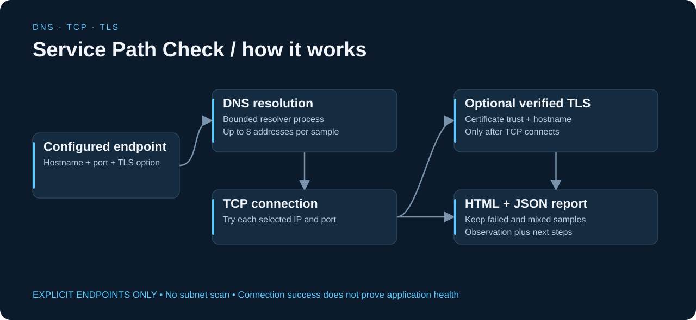
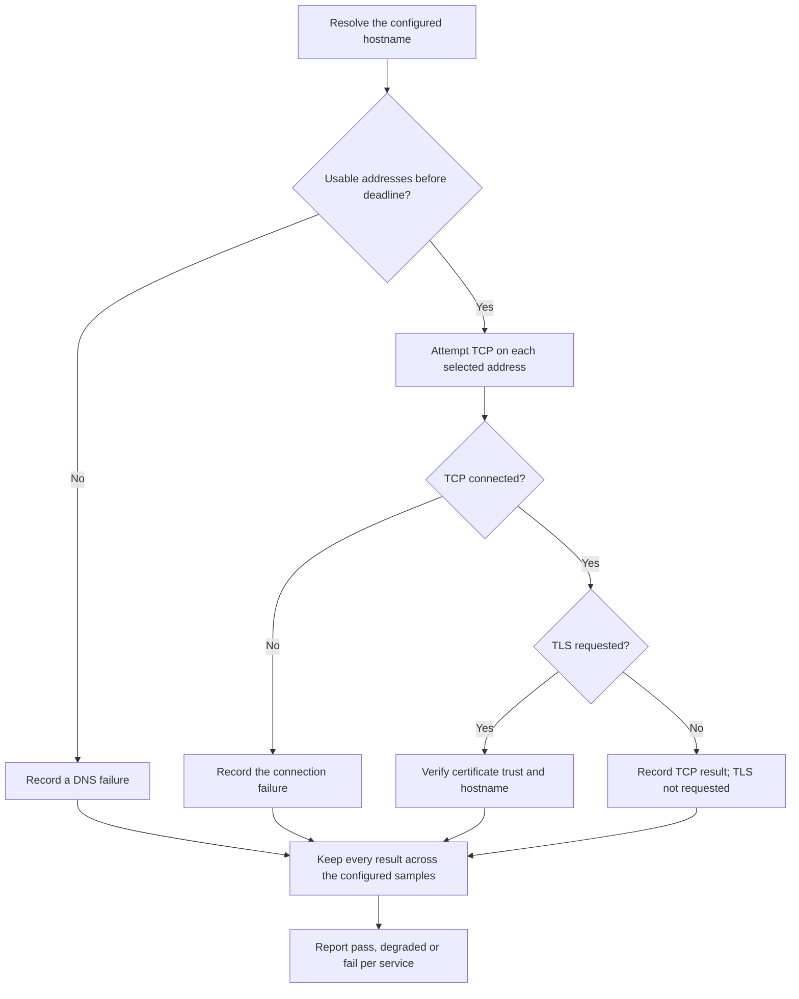
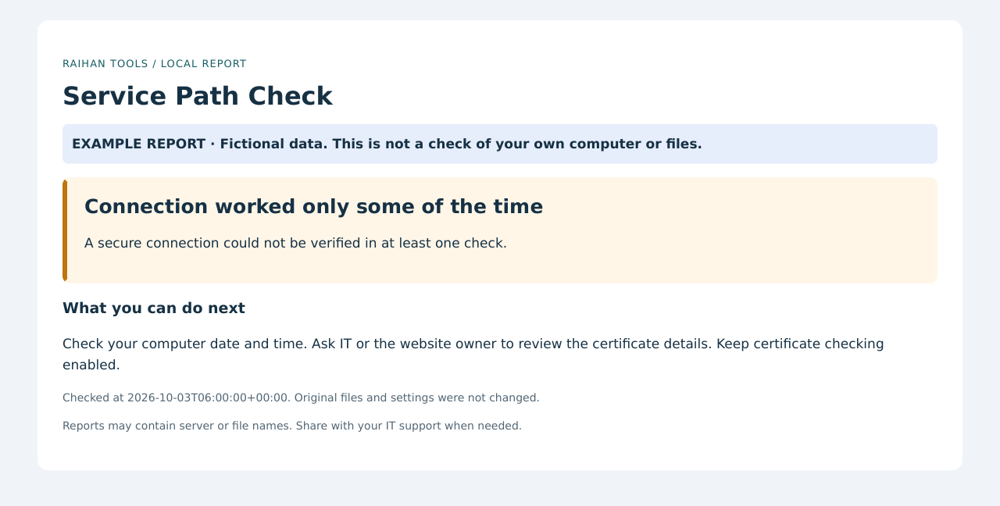
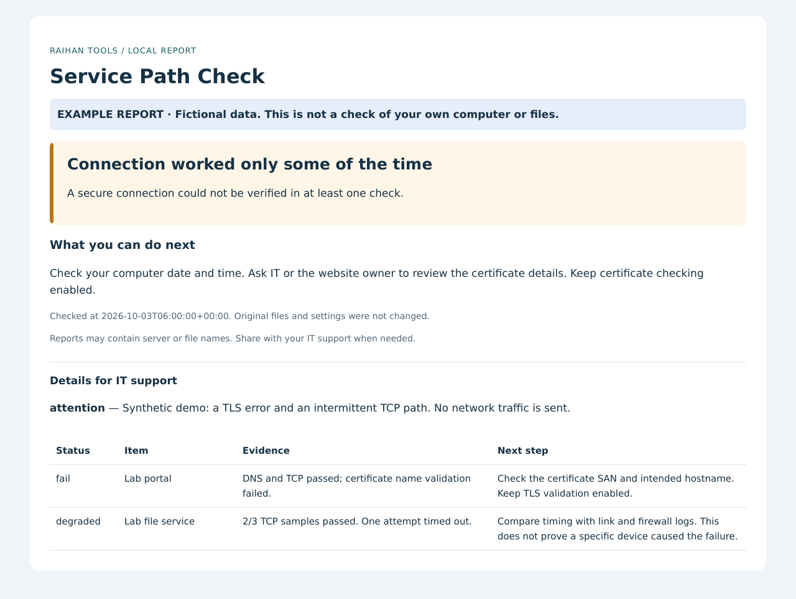

# Service Path Check — visual guide

[Back to the project](../README.md) · [Beginner steps](../START-HERE.md) · [Technical reference](TECHNICAL-REFERENCE.md)

## Follow the data



A server answers ping but the service still does not work. Check name resolution, the actual TCP port and optional verified TLS separately, then save the findings.

## Follow the decisions



The diagram summarizes the implementation. Error and incomplete states remain visible; a successful result applies only to the checks actually performed.

## Read an actual demo output

These images render the HTML produced by the current tool with its included fictional example data. They are report previews, not Windows desktop captures or production results. The detail image exposes the evidence table; timestamps reflect report generation or the supplied fixture.

### Plain-language overview



### Findings and suggested next steps



| Example item | Result | What you are seeing |
|---|---|---|
| Lab portal | Fail | DNS and TCP pass, but TLS hostname verification fails. |
| Lab file service | Degraded | Two of three fictional TCP samples pass; one times out. |

Download and open [the complete HTML report](demo-report.html), or inspect [the exact JSON evidence](demo-report.json). GitHub displays HTML as source; the images above show its rendered content.

## Connect the diagram to the code

| File | Responsibility |
|---|---|
| [service_path_check.py](../service_path_check.py) | Validates targets and runs DNS, TCP and optional TLS checks. |
| [desktop.py](../desktop.py) | Converts simple desktop inputs into explicit service settings. |
| [report.py](../report.py) | Presents results and preserves detailed observations. |
| [tests/test_service_path.py](../tests/test_service_path.py) | Exercises local connections, deadlines, TLS and mixed outcomes. |

## What this demonstrates

TCP/IP troubleshooting, DNS resolution, TCP connectivity, TLS validation and careful interpretation of network evidence.

Tests only explicitly configured endpoints. A successful path does not establish login access, application functionality or uptime. A failed connection alone cannot identify the responsible device. The offline demo sends no network traffic.

## Reproduce these previews

Use Python 3.11+ from the repository root:

```sh
python service_path_check.py --demo --output docs/demo-report
python -m pip install -r docs/requirements-visuals.txt
python docs/render_previews.py
```

The demo intentionally returns exit code **1** because its data contains findings. That is expected. The rendering dependencies are optional documentation tools; the application itself does not need them. `render_previews.py` renders local HTML without browser access or external resources. It does not run live network checks or collect Windows settings.

The editable architecture source is [architecture.svg](images/architecture.svg); the flowchart source is [workflow.mmd](workflow.mmd).
